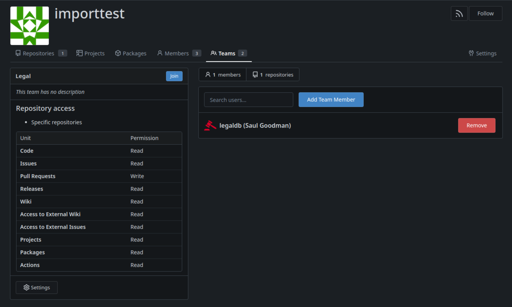
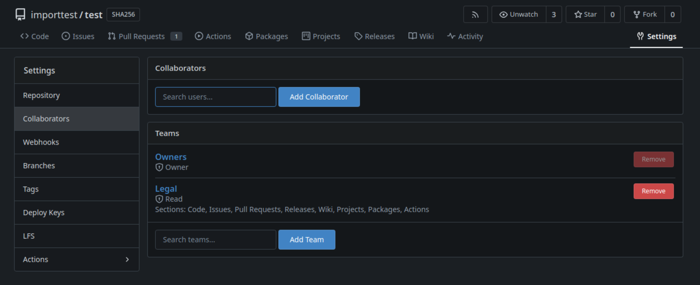
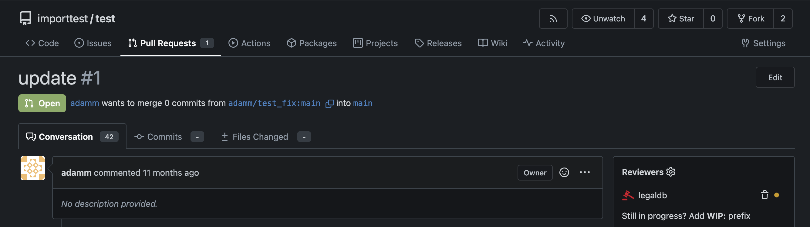
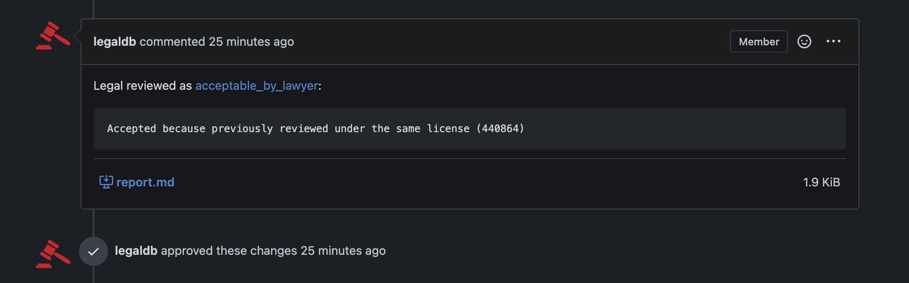

# Gitea Legal Reviews at SUSE

This guide explains how to enable legal reviews with [Cavil](https://github.com/openSUSE/cavil) for your
repositories on the SUSE Gitea instances https://src.opensuse.org and https://src.suse.de.

## Organisation

Add a `Legal` team to the organisation you want to perform legal reviews for, and then add the `legaldb` user. The team
requires pull request write permissions to be able to add reports to review comments.

## Repository

Add the `Legal` team as a collaborator to each repository that you want to perform legal reviews for.

## Pull Requests

Now that legal reviews have been activated, just add the `legaldb` user as a reviewer to your pull requests.

And once the legal review has yielded a result the bot will `approve` or `reject` the pull request and leave you a
legal report with the details.

