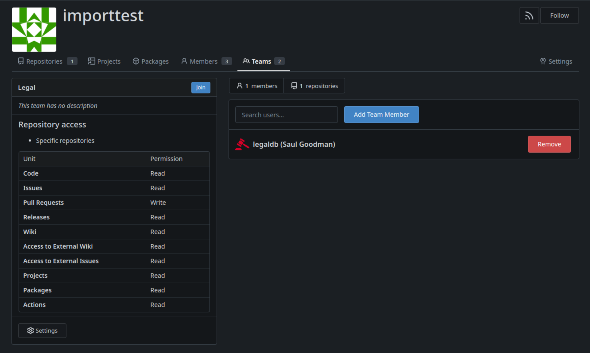
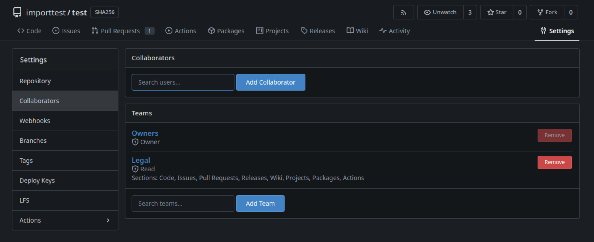
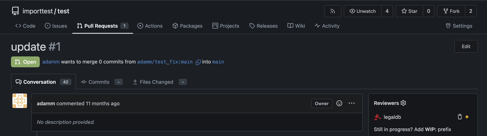
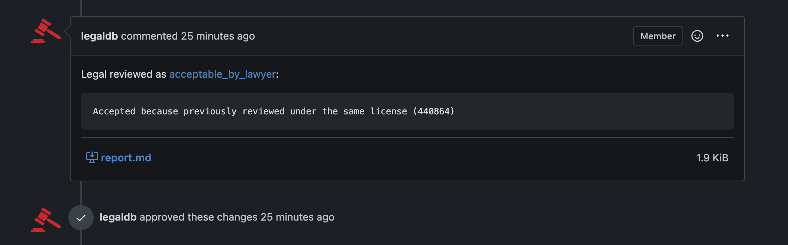
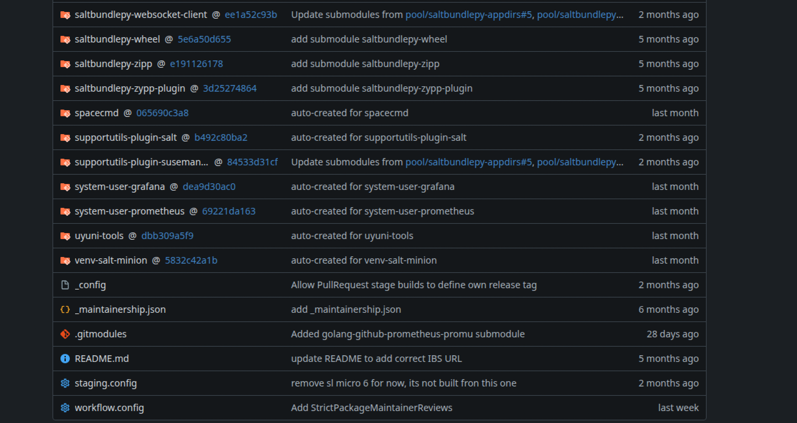
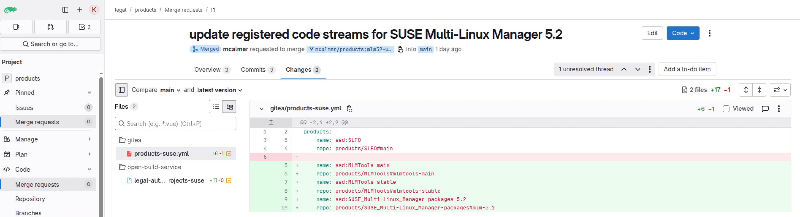
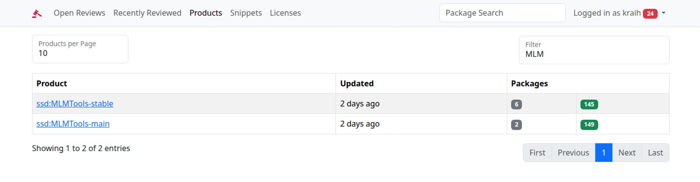

# Gitea Legal Reviews at SUSE

**IMPORTANT: The legal review bot should not yet be used for embargoed security updates!**
This guide explains how to enable legal reviews with [Cavil](https://github.com/openSUSE/cavil) for your
repositories on the SUSE Gitea instances https://src.opensuse.org and https://src.suse.de.

## Summary

* Legal reviews are required for all package updates distributed to customers
* Active product codestreams are required to be registered
* Legal reviews of updates to product codestreams are only required if the repository contains materials distributed
  to customers, such as vendored packages not using submodules

## Organisation

Add a `Legal` team to the organisation you want to perform legal reviews for, and then add the `legaldb` user. The team
requires **pull request write permissions** to be able to add reports to review comments.

## Repository

Add the `Legal` team as a collaborator to each repository that you want to perform legal reviews for.

## Pull Requests

Now that legal reviews have been activated, just add the `legaldb` user as a reviewer to your pull requests.

And once the legal review has yielded a result the bot will `approve` or `reject` the pull request and leave you a
legal report with the details.

All packages distributed to customers are required to go through this process!

## Product Reviews

Product codestreams in the git workflow are repositories using the _ObsPrj format. Usually stored in an organisation
called `products`, like `products/MLMTools`.

Individual packages are included in products as submodules and are expected to receive their legal review in the
repository they originate from, usually in a `pool` organisation. The product repository itself only requires legal
reviews on pull requests if it contains materials distributed to customers, such as packages vendored into the
repository without the use of submodules.

To ensure thorough legal reviews, all product codestreams are expected to be registered. This is a self service
process, performed with a simple pull request on [GitLab](https://gitlab.suse.de/legal/products/). Once merged all
active packages in your codestreams will be kept up to date to speed up future legal reviews. Don't forget to send
another pull request to remove them again once codestreams become inactive.

Just add your codestreams to the appropriate config file:

* `gitea/products-opensuse.yml`: All active product codestreams from `src.opensuse.org`
* `gitea/products-suse.yml`: All active product codestreams from `src.suse.de`

Registered product codestreams will be synchronized daily and become visible as a product in
[LegalDB](https://legaldb.suse.de/products).

